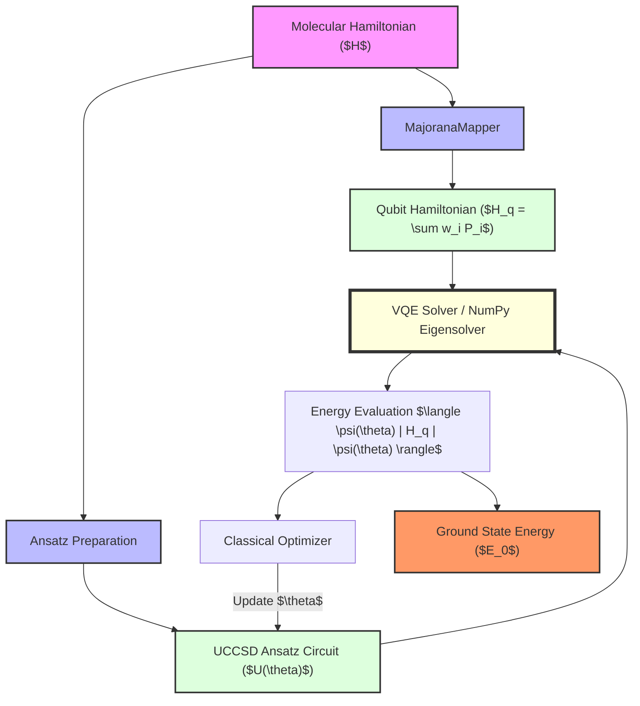

# VQE/Eigensolver Workflow Diagram

This Mermaid diagram illustrates the flow from a molecular Hamiltonian to the final ground state energy calculation.

```mermaid
graph TD
    A["Molecular Hamiltonian ($H$)"] --> B["MajoranaMapper"]
    A --> C["Ansatz Preparation"]
    B --> D["Qubit Hamiltonian ($H_q = \sum w_i P_i$)"]
    C --> E["UCCSD Ansatz Circuit ($U(\theta)$)"]
    D --> F["VQE Solver / NumPy Eigensolver"]
    E --> F
    F --> G["Energy Evaluation $\langle \psi(\theta) | H_q | \psi(\theta) \rangle$"]
    G --> H["Classical Optimizer"]
    H -- "Update $\theta$" --> E
    G --> I["Ground State Energy ($E_0$)"]
    
    style A fill:#f9f,stroke:#333,stroke-width:2px
    style B fill:#bbf,stroke:#333,stroke-width:2px
    style C fill:#bbf,stroke:#333,stroke-width:2px
    style D fill:#dfd,stroke:#333,stroke-width:2px
    style E fill:#dfd,stroke:#333,stroke-width:2px
    style F fill:#ffd,stroke:#333,stroke-width:4px
    style I fill:#f96,stroke:#333,stroke-width:2px
```
